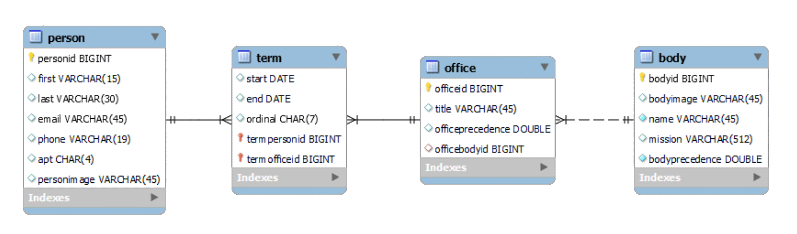
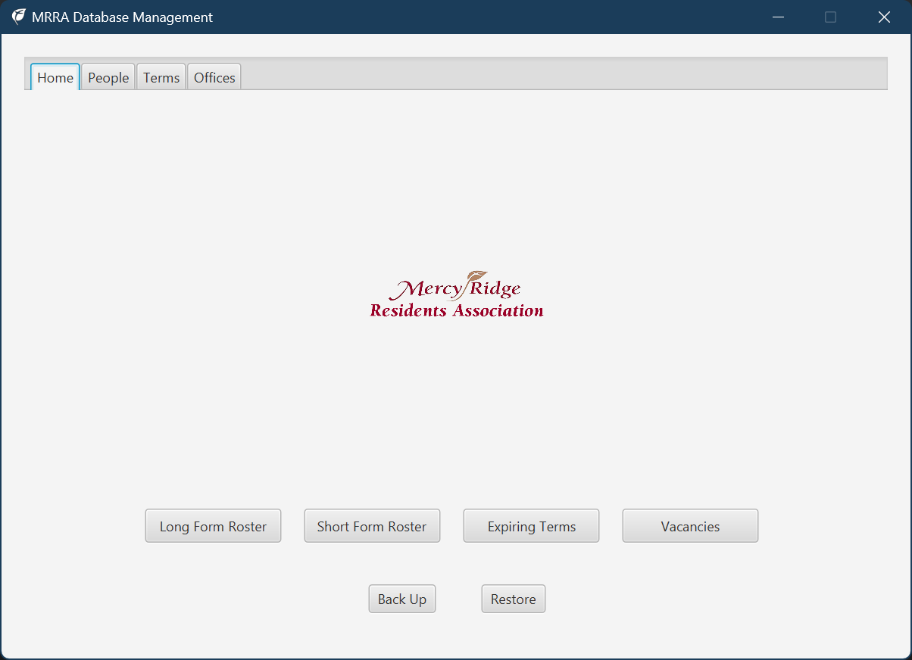

[Mercy Ridge](https://mercyridge.com/) is a retirement community in Timonium, Maryland. Its residents have formed
a [Residents Association](https://mrra.online/) to facilitate engagement, discussion, and participation, both within the
Association and with management, with respect to matters related to our mutual interest and benefit.

This project maintains a [MySQL](https://www.mysql.com/) database to support the Residents Association's committee
structure.

The objective is to manage the many-to-many relationship between people and offices via a term record and a many-to-one
relationship between offices and administrative bodies, as shown in the entity-relationship diagram above. Access to the
database is via a
[JavaFX](https://openjfx.io/) application.

The JavaFX application connects to the database via
[jOOQ](https://www.jooq.org/) middleware. It generates reports by calling
the [TeX document production system](https://tug.org/). The user interface is not mobile friendly.

# Installation

This project does not currently feature an installer. It is runnable in an IDE (tested only with IntelliJ IDEA 2021.3.2
Ultimate Edition). It requires installation of the following.

- MySQL (tested only with MySQL 8.0 Community Edition).

- [TeX Live](https://tug.org/texlive/) (tested only with TeX Live 2020).

- A PDF viewer (tested only with Adobe Acrobat Pro DC).

# Usage

Currently runnable from within an IDE. JavaFX user interface provides CRUD operations for database management and report
generation.

# History

Developed during the period 2020--2022. First posted to GitHub on 2022-01-10.

# Credits

Written by [George Wright](mailto:geo@loyola.edu), with help from

- [Eugen (Baeldung)](https://twitter.com/baeldung),

- [Lukas Eder](https://www.crunchbase.com/person/lukas-eder),

- [John Thompson](https://springframework.guru/about/), and

- A host of contributors to [Stack Overflow](https://stackoverflow.com/).

# License

The MIT free software license is incorporated by
[reference](https://mit-license.org/).
